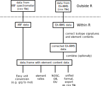

<!-- README.md is generated from README.Rmd. Please edit that file -->

```{r, echo = FALSE}
knitr::opts_chunk$set(
  collapse = TRUE,
  comment = "#>",
  fig.path = "man/figures"
)
# Please put your title here to include it in the file below.
Title <- "Title of your paper goes here"
```

# elco

<!-- badges: start -->
[](https://www.tidyverse.org/lifecycle/#experimental)
<!-- badges: end -->

## Overview

'elco' provides functions to handle and (rudimentary) analyze element content data and isotope signature data. Features are:

1. **Import of XRF and IRMS data** as they can be exported from X-ray fluorescence spectrometers (Rigaku ZSX Primus II) and EA-IRMS devices (HEKATech's Eurovector
EA3000 coupled with Nu Instruments Nu Horizon).

2. Graphical display for easy **data checking**.

3. **Correction of IRMS-measured element content data and isotope signatures** in cases of a mismatch in the signal areas between samples and standards.

4. **Unit conversion** of element content data (e.g. g/g to mol).

5. Computation of the **nominal oxidation state of carbon (NOSC), oxidative ratio (OR), and degree of unsaturation (DU)** [@Worrall.2016b; @Masiello.2008].

```{r, out.width="50%", fig.align='center', echo=FALSE}

```


### How to install

elco can be installed from GitHub:

```{r, eval = FALSE}
remotes::install_github("henningte/elco")
```


### How to use

Here is a short overview on elco general-purpose capabilities (handling element content ratios). Examples of how to import and correct data are not described here, but in the vignettes.

```{r, mesage = FALSE, warning=FALSE}
library(elco)

# load other required packages
library(dplyr)
library(magrittr)
```


First, we have a short look at the sample data and its structure:

```{r}
d <- elco::chno
d
```

Contents for one element are stored in a numeric vector. Measurement units and errors are tracked using the [quantities](https://github.com/r-quantities/quantities) package.

elco supports unit conversion (using the functions of the units package and molar masses from [PeriodicTable](https://github.com/cran/PeriodicTable)):

```{r}
# g_C/g_sample to mol_C/g_sample (umol_C/g_sample)
units::set_units(d$C, value = "mol_C/g_sample", mode = "standard")
units::set_units(d$C, value = "umol_C/g_sample", mode = "standard")
```


`elco_convert()` can be used to batch-convert units. This will convert the numerator of the unit while it keeps the denominator. For example, here we convert g_C/g_sample to mmol_C/g_sample (and similarly for all other elements in `d`):

```{r}
# g/g to mol
d %>% 
  dplyr::mutate(
    dplyr::across(
      ! dplyr::all_of("sample_mass"), 
      \(.x) elco_convert(.x, to = "mmol"))
  )
```

elco helps computing element ratios:

```{r}
d %>%
  dplyr::mutate(
    cn_molar = elco_convert(C, to = "mol") / elco_convert(N, to = "mol")
  )
```

Finally, elco provides functions to compute the nominal oxidation state of carbon (NOSC), oxidative ratio (OR), and degree of unsaturation (DU) [@Worrall.2016b; @Masiello.2008]

```{r}
d <- 
  d %>% 
  dplyr::mutate(
    dplyr::across(
      ! dplyr::all_of("sample_mass"),
      function(.x) elco_convert(.x * sample_mass, to = "mol")
    )
  ) %>%
  dplyr::mutate(
    nosc = elco_nosc(C = C, H = H, N = N, O = O),
    or = elco_or(C = C, H = H, N = N, O = O),
    du = elco_du(C = C, H = H, N = N)
  )
```

Further information can be found in the vignettes:

+ [Importing and Manipulating IRMS data](vignettes/v002-irms-functions.Rmd)


### How to cite

Please cite this compendium as:

> Teickner, H. and Knorr, K.-H., (`r format(Sys.Date(), "%Y")`). _elco: Handling data on chemical element contents and isotope signatures._. Accessed `r format(Sys.Date(), "%d %b %Y")`. Online at <https://github.com/henningte/elco>

### Acknowledgments

We thank @Gaka.2019 for the provision of test data.

### Licenses

**Text and figures :**  [CC-BY-4.0](http://creativecommons.org/licenses/by/4.0/)

**Code :** See the [DESCRIPTION](DESCRIPTION) file

**Data :** [CC-BY-SA-4.0](https://creativecommons.org/licenses/by-sa/4.0/deed.en). All external data (files "xrf1.csv", "xrf2.csv", "irms1.csv", and "irms2.csv") for elco were provided by @Gaka.2019. `elco::irms_standards` was collected from different data sources [@Coplen.2006; @IVAAnalysentechnikGmbHuCoKGt.2016] and own measurements (see the documentation for details). `elco::chno` was created by the package's authors.

### Contributions

We welcome contributions from everyone. Before you get started, please see our [contributor guidelines](CONTRIBUTING.md). Please note that this project is released with a [Contributor Code of Conduct](CONDUCT.md). By participating in this project you agree to abide by its terms.

### Sources

All data for this package are from @Gaka.2019.

