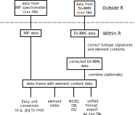

<!-- README.md is generated from README.Rmd. Please edit that file -->

# elco

<!-- badges: start -->

[](https://www.tidyverse.org/lifecycle/#experimental)
<!-- badges: end -->

## Overview

‘elco’ provides functions to handle and (rudimentary) analyze element
content data and isotope signature data. Features are:

1.  **Import of XRF and IRMS data** as they can be exported from X-ray
    fluorescence spectrometers (Rigaku ZSX Primus II) and EA-IRMS
    devices (HEKATech’s Eurovector EA3000 coupled with Nu Instruments Nu
    Horizon).

2.  Graphical display for easy **data checking**.

3.  **Correction of IRMS-measured element content data and isotope
    signatures** in cases of a mismatch in the signal areas between
    samples and standards.

4.  **Unit conversion** of element content data (e.g. g/g to mol).

5.  Computation of the **nominal oxidation state of carbon (NOSC),
    oxidative ratio (OR), and degree of unsaturation (DU)** (Worrall et
    al. 2016; Masiello et al. 2008).



### How to install

elco can be installed from GitHub:

``` r
remotes::install_github("henningte/elco")
```

### How to use

Here is a short overview on elco general-purpose capabilities (handling
element content ratios). Examples of how to import and correct data are
not described here, but in the vignettes.

``` r
library(elco)
#> Loading required package: quantities
#> Loading required package: units
#> udunits database from C:/Users/henni/AppData/Local/R/win-library/4.2/units/share/udunits/udunits2.xml
#> Loading required package: errors

# load other required packages
library(dplyr)
#> 
#> Attaching package: 'dplyr'
#> The following objects are masked from 'package:stats':
#> 
#>     filter, lag
#> The following objects are masked from 'package:base':
#> 
#>     intersect, setdiff, setequal, union
library(quantities)
library(magrittr)
```

First, we have a short look at the sample data and its structure:

``` r
d <- elco::chno
d
#> # A tibble: 5 × 5
#>              C            H             N            O sample_mass
#>    (err) [g/g]  (err) [g/g]   (err) [g/g]  (err) [g/g]  (err) [mg]
#> 1 0.4928286(0)  0.177478(0) 0.09203495(0) 0.1705965(0)     3.78(1)
#> 2 0.4970892(0) 0.1692088(0) 0.09216568(0) 0.1640896(0)     3.81(1)
#> 3 0.5218047(0)  0.162892(0) 0.09125226(0) 0.1606575(0)    3.494(4)
#> 4 0.5008897(0) 0.1642393(0) 0.08918042(0)  0.165484(0)    4.251(3)
#> 5 0.5016323(0) 0.1738859(0) 0.09247861(0) 0.1609109(0)    4.046(9)
```

Contents for one element are stored in a numeric vector. Measurement
units and errors are tracked using the
[quantities](https://github.com/r-quantities/quantities) package. elco
adds to this an identifier for the element:

``` r
# show exemplary structure for the C content
d$C
#> Element: C
#> Units: [g/g]
#> Errors: 0 0 0 0 0
#> [1] 0.4928286 0.4970892 0.5218047 0.5008897 0.5016323
```

New elco objects can be defined with `elco_new_elco` (by providing a
quantities object and an element symbol). For instance, this specifies
two new C content values:

``` r
x <- 
  quantities::set_quantities(c(0.3, 0.43), unit = "g/g", errors = c(0.2, 0.12)) %>%
  elco_new_elco(el_symbol = "C")
x
#> Element: C
#> Units: [g/g]
#> Errors: 0.20 0.12
#> [1] 0.30 0.43
```

elco supports unit conversion (using the functions of the quantities
package and molar masses from
[PeriodicTable](https://github.com/cran/PeriodicTable)):

``` r
# g/g to mol
x %>% 
  elco_elco_convert(to = "mol", 
                    sample_mass = quantities::set_quantities(1, unit = "g", errors = 0))
#> Element: C
#> Units: [mol]
#> Errors: 0.016651819 0.009991091
#> [1] 0.02497773 0.03580141

# g/g to mg
x %>% 
  elco_elco_convert(to = "mg", 
                    sample_mass = quantities::set_quantities(1, unit = "g", errors = 0))
#> Element: C
#> Units: [mg]
#> Errors: 200 120
#> [1] 300 430
```

… even with complete data.frames!

``` r
# g/g to mol
d %>% elco_elco_convert_df(to = "mol", sample_mass = d$sample_mass)
#> # A tibble: 5 × 5
#>             C           H           N           O sample_mass
#>   (err) [mol] (err) [mol] (err) [mol] (err) [mol]  (err) [mg]
#> 1 1.552(5)e-4  6.66(2)e-4 2.485(7)e-5  4.03(1)e-5     3.78(1)
#> 2 1.578(5)e-4  6.40(2)e-4 2.509(8)e-5  3.91(1)e-5     3.81(1)
#> 3 1.518(2)e-4 5.647(7)e-4 2.276(3)e-5 3.508(4)e-5    3.494(4)
#> 4 1.773(1)e-4 6.927(5)e-4 2.707(2)e-5 4.397(3)e-5    4.251(3)
#> 5 1.690(4)e-4  6.98(2)e-4 2.671(6)e-5 4.069(9)e-5    4.046(9)
```

elco helps computing element ratios:

``` r
d %>%
  elco_elco_convert_df(to = "mol", sample_mass = d$sample_mass) %>%
  dplyr::mutate(cn_molar = C/N,
                ch_molar = C/H,
                co_molar = C/O)
#> # A tibble: 5 × 8
#>             C         H        N        O sample_mass cn_molar ch_molar co_molar
#>   (err) [mol] (err) [m… (err) [… (err) […  (err) [mg] (err) [… (err) [… (err) […
#> 1 1.552(5)e-4 6.66(2)e… 2.485(7… 4.03(1)…     3.78(1)  6.24(3) 0.233(1)  3.85(2)
#> 2 1.578(5)e-4 6.40(2)e… 2.509(8… 3.91(1)…     3.81(1)  6.29(3) 0.247(1)  4.04(2)
#> 3 1.518(2)e-4 5.647(7)… 2.276(3… 3.508(4…    3.494(4)  6.67(1) 0.2688(… 4.327(7)
#> 4 1.773(1)e-4 6.927(5)… 2.707(2… 4.397(3…    4.251(3) 6.550(6) 0.2559(… 4.032(4)
#> 5 1.690(4)e-4 6.98(2)e… 2.671(6… 4.069(9…    4.046(9)  6.33(2) 0.2421(…  4.15(1)
```

Finally, elco provides functions to compute the nominal oxidation state
of carbon (NOSC), oxidative ratio (OR), and degree of unsaturation (DU)
(Worrall et al. 2016; Masiello et al. 2008)

``` r
d <- 
  d %>%
  elco::elco_elco_convert_df(to = "mol", sample_mass = d$sample_mass) %>%
  dplyr::mutate(
    nosc = elco_nosc(C, H, N, O),
    or = elco_or(C, H, N, O),
    du = elco_du(C, H, N)
  )
```

Further information can be found in the vignettes:

-   [Reformatting and checking raw data (csv files) from the X-ray
    fluorescence device (ZSX Primus II, Rigaku)](vignettes/v001-xrf.Rmd)

-   [Importing and Manipulating IRMS
    data](vignettes/v002-irms-functions.Rmd)

-   [Computation with element contents - unit conversion, element
    ratios, nominal oxidation state of carbon, oxidative ratio, and
    degree of unsaturation](vignettes/v004-element-ratios.Rmd)

### How to cite

Please cite this compendium as:

> Teickner, H. and Knorr, K.-H., (2022). *elco: Handling data on
> chemical element contents and isotope signatures.*. Accessed 28 Apr
> 2022. Online at <https://github.com/henningte/elco>

### Acknowledgments

We thank Gałka et al. (2019) for the provision of test data.

### Licenses

**Text and figures :**
[CC-BY-4.0](http://creativecommons.org/licenses/by/4.0/)

**Code :** See the [DESCRIPTION](DESCRIPTION) file

**Data :**
[CC-BY-SA-4.0](https://creativecommons.org/licenses/by-sa/4.0/deed.en).
All external data (files “xrf1.csv”, “xrf2.csv”, “irms1.csv”, and
“irms2.csv”) for elco were provided by Gałka et al. (2019).
`elco::irms_standards` was collected from different data sources (Coplen
et al. 2006; IVA Analysentechnik GmbH & Co. KGt 2016) and own
measurements (see the documentation for details). `elco::chno` was
created by the package’s authors.

### Contributions

We welcome contributions from everyone. Before you get started, please
see our [contributor guidelines](CONTRIBUTING.md). Please note that this
project is released with a [Contributor Code of Conduct](CONDUCT.md). By
participating in this project you agree to abide by its terms.

### Sources

All data for this package are from Gałka et al. (2019).

<div id="refs" class="references csl-bib-body hanging-indent">

<div id="ref-Coplen.2006" class="csl-entry">

Coplen, Tyler B., Willi A. Brand, Matthias Gehre, Manfred Gröning, Harro
A. J. Meijer, Blaza Toman, and R. Michael Verkouteren. 2006. “<span
class="nocase">New guidelines for
C
measurements</span>.” *Analytical Chemistry* 78 (7): 2439–41.
<https://doi.org/10.1021/ac052027c>.

</div>

<div id="ref-Gaka.2019" class="csl-entry">

Gałka, M., T. Broder, H. Teickner, and K.-H. Knorr. 2019. “<span
class="nocase">Randomized dummy IRMS and XRF data for peat for the R
package elco</span>.”

</div>

<div id="ref-IVAAnalysentechnikGmbHuCoKGt.2016" class="csl-entry">

IVA Analysentechnik GmbH & Co. KGt. 2016. “Elementaranalyse Eurovector/
HEKAtech.” Edited by IVA Analysentechnik GmbH & Co. KGt.
<https://www.iva-analysentechnik.de/wp-content/uploads/2016/05/EA_Eurovector_2016_Rev01.pdf>.

</div>

<div id="ref-Masiello.2008" class="csl-entry">

Masiello, C. A., M. E. Gallagher, J. T. Randerson, R. M. Deco, and O. A.
Chadwick. 2008. “Evaluating Two Experimental Approaches for Measuring
Ecosystem Carbon Oxidation State and Oxidative Ratio.” *Journal of
Geophysical Research* 113 (G3): G03010.
<https://doi.org/10.1029/2007JG000534>.

</div>

<div id="ref-Worrall.2016b" class="csl-entry">

Worrall, Fred, Gareth D. Clay, Catherine S. Moody, Tim P. Burt, and Rob
Rose. 2016. “<span class="nocase">The effective oxidation state of a
peatland</span>.” *Journal of Geophysical Research: Biogeosciences* 121
(1): 145–58. <https://doi.org/10.1002/2015JG003182>.

</div>

</div>
